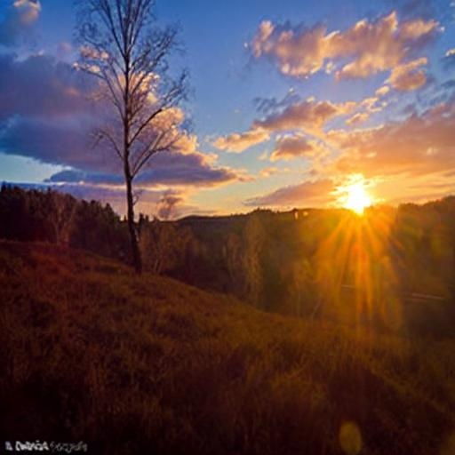
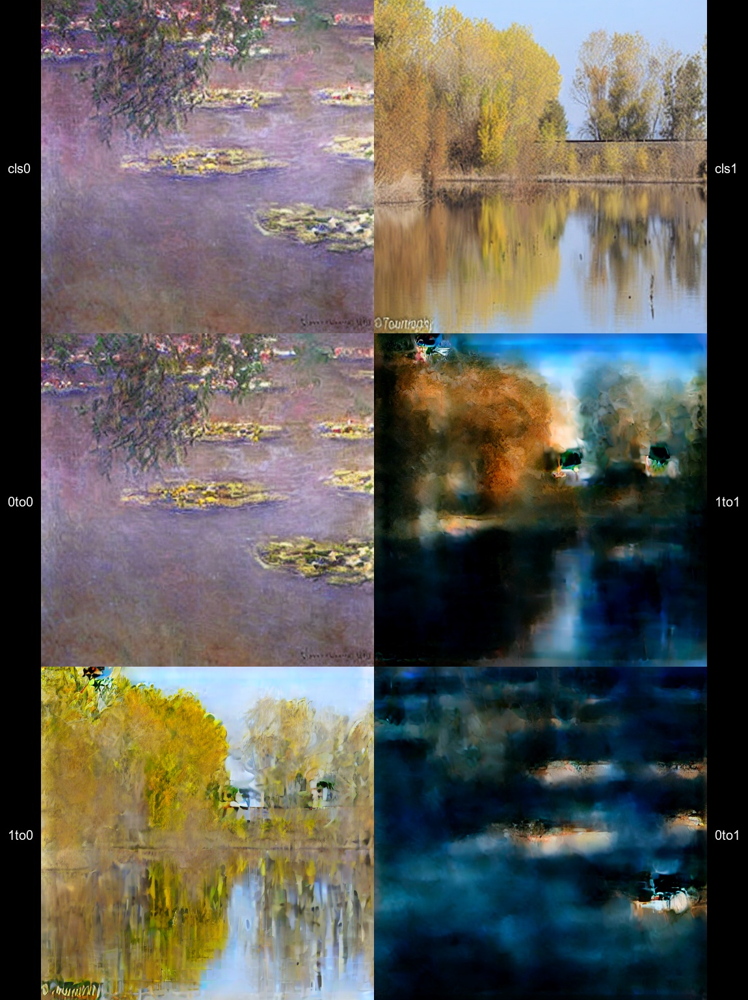
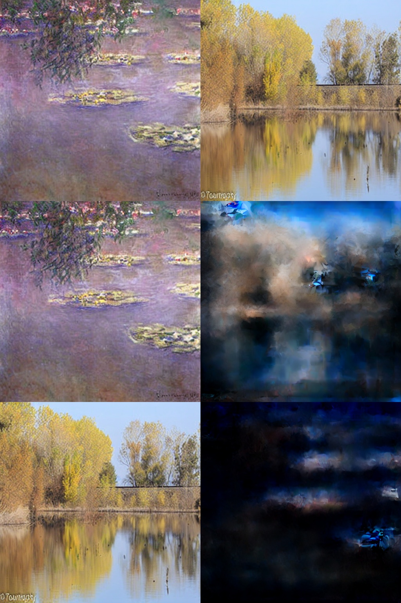

#### 根据生成图片发现了如下问题：
**技巧尝试**
- 莫奈图片与真实图片数量不平衡，因此引入WeightedRandomSampler
    - 但在stage2中并没有进行基于权重的数据配对。由于来自莫奈数据集的数据较少，模型学习0to1的能力会比学习1to0要更弱
    - 解决办法：在run_gen中记录图片来源，在stage2中根据图片来源比例进行WeightedRandomSampler
    - 感觉有道理
- stage1中仅仅是随机取样，因此选取的莫奈图片与真实图片在内容上关联性较低。尝试引入OT(opitmal transport)，增强选取图片对的关联性。
    - 最终结果没有特别好
    - 推测原因：一个batch中来自不同数据集的两张图片在语义上相近的可能性较低，加入OT仍然无法进行针对性学习，甚至可能强行让模型学习错误的配对

- VAE_ca_proj方法最终生成的图片中虽然画面没有崩坏，但是0to0，0to1输出与原图几乎一致，1to1，1to0也出现了一样的问题——Conditional Collapse
    - 推测原因：恒等变换能够使得loss下降，模型偷懒导致没有学会东西
    - 尝试加入CFG，让模型学习无风格下应该如何画图，反过来认识到莫奈风格与现实风格之间的差距，从而让模型主动学习莫奈风格
    - 最终还没有尝试出来比较合适的参数（已尝试在inference过程中让cfg scale=2.0，2.5，3.0，但是图片差异不大）
- 原先的t_emb和s_emb是简单相加的，二者之间会互相影响。调整为将s_emb拼接在t_emb后面
- stage1学习并不完美，在run_gen中采样得到的数据对可能有部分图片本身是模糊或者不可用的
    - 尝试使用(z - mu) / std比较图片内容的一致性程度，避免decode出来在图片上计算LPIPS。最终将一致性最差的20%筛去

- 在stage1的损失函数中加上gram损失，以强调风格差异。
    - 最终变成负优化，因为stage1本身已经在学习风格变换，加入gram反而增大了学习负担
    - gram本身是针对图片的，但是潜空间中对图片进行了抽象，保留下来的语义和纹理特征可能不强，与gram相性不佳

**参数尝试**
- sd1.5应该对于现实图片有先验知识，表现为1to1甚至能够将细节补充的更加完善：
经过1to1处理后：

原图：

    - 尝试将identity_weights改为[1.8,0.8]，但最终0to0和1to1都崩坏了
    - 尝试设置为[1.0,1.0]，画面仍然崩坏
    - 感觉应该将identity_weights中1to1的比重设置的更大一些

    - 尝试降低IDENTITY_RATE，让模型更加重视风格转换而不是输出原图，但是最终表现为模型连恒等映射都做不好了

- 模型学习比较不稳定，并不是训练步数越多越好，经常出现效果不稳定的情况
    - 尝试加入ema。初步尝试decay=0.999，但是仅仅跑50个epoch左右无法充分体现ema的优势，最终体现为stage1中ema效果不如raw（不加ema）
    raw：
    
    ema：
    
    - 尝试强行使用ema，将decay设置成0.9，但是过分的扰动反而违背ema初衷，最后效果不好
    - 结论：不要加ema

- 模型在训练后期仍然出现了明显的震荡现象，推测为模型无法收敛到局部最小值。且模型前期画面容易崩坏，推测可能是前期学习率过大
    - 加入warm up 和 cosine decay，前期缓慢增大学习率，防止扰动过于剧烈，后期缓慢减小学习率，帮助模型收敛至局部最优值
    - 效果比较好，起码前期不那么容易崩坏了

- 原先的batch数量过小，每个batch之间的差异较大，模型抖动剧烈
    - 尝试加入checkpointing和FP16精度量化，最终batch_size=64在8G显存的4060上可以跑起来
    - 但最后画面出现较多的短直线和大面积黑色，推测是精度不够导致溢出

